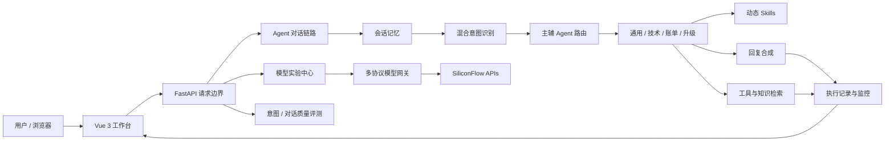

<div align="center">

# EpochFlow · 纪流

### 可观测、可评测、可部署的多 Agent 运行与模型实验平台

**理解请求 · 编排能力 · 执行工具 · 观察过程 · 评测结果**

<p>
  <a href="https://epochflow-web.onrender.com/"><strong>🚀 点击这里，立即体验在线系统 →</strong></a>
</p>

<p>无需注册 · 无需访问码 · 浏览器直接使用</p>

[](https://epochflow-web.onrender.com/)
[](https://github.com/ASEpochs/epochflow/actions/workflows/check.yml)
[](https://www.python.org/)
[](https://vuejs.org/)
[](https://render.com/)

<p>
  <a href="README_EN.md">English</a>
  ·
  <a href="docs/README.md">文档中心</a>
  ·
  <a href="docs/architecture.md">Agent 架构</a>
  ·
  <a href="docs/project-guide.md">项目导览</a>
</p>

</div>

> **快速开始：** 打开[在线工作台](https://epochflow-web.onrender.com/)，在“对话实验室”输入“登录失败，而且订单需要退款”，观察意图识别、主辅 Agent 路由和工具执行；随后进入“模型中心”或“知识空间”体验多模型与检索能力。Render 免费实例首次唤醒可能需要约一分钟。

## 项目简介

EpochFlow 是一个面向客服与知识服务场景的 Agent 工程项目，将一次模型请求拆成可观察的工程链路：**意图识别 → Agent 路由 → Skills 注入 → 工具调用 → 知识检索 → 回复合成 → 运行评测**。

项目关注的不只是“让大模型多回答一句话”，而是让 Agent 系统具备清晰的角色边界、可追踪的执行过程、可替换的模型能力和可重复的质量验证。系统包含 Vue 工作台、FastAPI 后端、多 Agent 编排器、轻量知识库、模型网关、评测模块、自动化测试与 Render 云端部署。


## 能力地图

| | 能力 | 解决的问题 |
| --- | --- | --- |
| 🧭 | **Intent & Routing** | 从混合诉求中提取意图和实体，选择主 Agent 与辅助 Agent |
| 🤖 | **Multi-Agent** | 隔离角色提示词、输出契约、模型参数与工具权限 |
| 🧩 | **Skills & Tools** | 按角色和关键词注入规则，并在白名单内执行工具 |
| 📚 | **Knowledge** | 导入、切片、检索并把相关上下文回注到本轮对话 |
| 🔬 | **Model Studio** | 在统一界面实验文字、视觉、生成、向量和重排模型 |
| 📈 | **Observe & Evaluate** | 记录路由与工具链路，通过用例和 LLM-as-Judge 检查质量 |

## 一眼看懂项目

| 维度 | 当前实现 |
| --- | --- |
| Agent | 通用、技术、账单、人工升级 4 类角色，支持主辅 Agent 协作 |
| 模型 | 接入硅基流动 50 个模型标识，覆盖 9 类任务 |
| 工具 | Agent 工具白名单、参数校验、执行记录、缓存与降级 |
| 知识 | 文档导入、切片、检索、结果回注与浏览器导出 |
| Skills | 3 个可热加载业务 Skill，按角色与关键词动态注入 |
| 可观测性 | request_id、意图置信度、路由原因、工具输入输出与延迟 |
| 评测 | 意图案例、对话质量、LLM-as-Judge 与报告导出 |
| 工程验证 | 38 项后端测试、6 项浏览器端到端测试、GitHub Actions |
| 部署 | Vue Static Site + Python Free Web Service，无持久磁盘 |

## 核心能力

### 1. 路由驱动的多 Agent 协作

- 先识别细粒度意图与结构化实体，再决定由哪个 Agent 处理。
- 复杂请求可以选择一个主 Agent 和多个辅助 Agent，而非简单切换 prompt。
- 每个角色拥有独立的 system prompt、输出契约、模型参数和工具白名单。
- 执行结果返回路由原因、置信度、参与角色和工具调用明细。

### 2. 多协议模型网关与模型中心

- 同时适配 Anthropic Messages 和 OpenAI Chat Completions 风格接口。
- 使用请求级上下文隔离模型选择，避免并发会话相互覆盖配置。
- 根据任务分别调用文字、视觉、图像、视频、语音、Embedding 与 Rerank API。
- 提供 50 个模型、9 类实验入口，并实时核验当前账号的模型清单。
- 视频任务采用提交与状态轮询分离，刷新页面后仍可恢复任务查询。


### 3. 可观察的 Agent 执行过程

工作台不会只显示最终回答。每次请求都可以检查：

- 意图分类、置信度与实体提取结果；
- 主 Agent、辅助 Agent 与路由理由；
- 工具名称、输入、输出、耗时和成功状态；
- 知识检索是否参与回答；
- 请求标识与端到端延迟。

### 4. 知识增强与动态 Skills

- 支持 TXT、Markdown、JSON 文档导入与分片。
- 免费云端版本采用进程内字符 n-gram 检索，避免引入付费数据库。
- 知识变更会主动清理检索缓存，防止删除内容继续被命中。
- Skills 以文件形式维护业务规则，可在运行时重新加载。
- 模型中心额外提供真实 Embedding 相似度和 Reranker 排序实验。

### 5. 评测与可靠性边界

- 支持自定义意图用例和多轮对话质量用例。
- 使用 LLM-as-Judge 对回答质量进行结构化评分并生成建议。
- 模型失败、超时或返回异常时显式报错，不伪造成功结果。
- 后端统一限制请求体、响应体、频率与并发，并为响应附加 request_id。
- Markdown 输出经过 DOMPurify 清理，供应商密钥始终保留在服务端。

## Agent 工作闭环


| Agent 阶段 | 当前实现 |
| --- | --- |
| 理解 Understand | 结合规则、模板与模型信号，输出细粒度意图、实体和置信度 |
| 路由 Route | 根据意图与运行状态选择主 Agent，并为复合诉求分配辅助 Agent |
| 装配 Equip | 读取临时会话记忆，按需注入 Skills、知识片段和工具定义 |
| 执行 Act | 在角色白名单内校验参数、调用工具，并把结果送回模型继续推理 |
| 合成 Compose | 汇总多个 Agent 与工具结果，生成一致、可读的最终回复 |
| 观察与评测 Observe | 返回 request_id、路由原因、工具日志和延迟，并支持自动化质量评测 |

这套闭环让系统的重点从“模型说了什么”扩展到“系统为什么这样路由、调用了什么、结果如何验证”。

## 系统架构



一次 Agent 对话的主链路：

```text
请求校验
  → 读取会话上下文
  → 意图识别与实体提取
  → 主辅 Agent 路由
  → Skills 与知识上下文注入
  → 工具调用循环
  → 回复合成
  → 写入临时记忆与执行记录
```

详细设计见[架构与运行约定](docs/architecture.md)和[项目导览与设计说明](docs/project-guide.md)。

## 技术栈

| 层次 | 技术 |
| --- | --- |
| 前端 | Vue 3、Vite、Lucide Icons、Marked、DOMPurify |
| 后端 | Python 3.12、FastAPI、Pydantic、HTTPX、Anthropic SDK |
| Agent | 意图识别、结构化路由、主辅 Agent、Skills、工具调用循环 |
| AI 能力 | SiliconFlow、DeepSeek、Qwen、GLM、Embedding、Rerank、多模态生成 |
| 数据 | 进程内会话记忆、字符 n-gram 知识检索、sessionStorage |
| 测试 | Pytest、FastAPI TestClient、Playwright |
| 工程化 | GitHub Actions、Render、环境变量、CORS、限流与健康检查 |

## 在线体验路线

### 路线 A：观察 Agent 如何协作

1. 打开[在线工作台](https://epochflow-web.onrender.com/)。
2. 在“对话实验室”输入包含两个诉求的问题，例如：`我的账号无法登录，而且刚才被重复扣款了。`
3. 查看右侧执行面板中的意图、主辅 Agent、路由理由和工具记录。

### 路线 B：体验多模型能力

1. 进入“模型中心”。
2. 按文字、视觉、图像、视频、语音、向量或重排筛选模型。
3. 选择模型运行单次实验，查看真实结果、耗时和 token 使用量。

### 路线 C：验证知识增强

1. 在“知识空间”添加一篇自定义文档。
2. 使用检索实验检查命中结果。
3. 回到对话实验室提问，并在执行记录中检查知识工具是否参与。

## 关键代码导航

| 模块 | 入口 |
| --- | --- |
| FastAPI 应用与 Agent 主链路 | [`backend/api/main.py`](backend/api/main.py) |
| 多 Agent 编排与工具循环 | [`backend/agents/agent_orchestrator.py`](backend/agents/agent_orchestrator.py) |
| 意图识别与缓存 | [`backend/core/intent_recognizer.py`](backend/core/intent_recognizer.py) |
| 请求级模型隔离与协议转换 | [`backend/core/model_scope.py`](backend/core/model_scope.py) |
| 多模态模型 API | [`backend/api/models.py`](backend/api/models.py) |
| 50 个模型目录 | [`backend/core/model_catalog.py`](backend/core/model_catalog.py) |
| 生产访问边界 | [`backend/api/security.py`](backend/api/security.py) |
| 免费知识检索 | [`backend/mcp/free_knowledge.py`](backend/mcp/free_knowledge.py) |
| 模型中心界面 | [`frontend/src/views/ModelsView.vue`](frontend/src/views/ModelsView.vue) |
| 前端会话状态 | [`frontend/src/composables/useWorkspace.js`](frontend/src/composables/useWorkspace.js) |

## 本地运行

环境要求：Python 3.12、Node.js 22.16+。

```powershell
git clone https://github.com/ASEpochs/epochflow.git
cd epochflow/backend
python -m venv .venv
.\.venv\Scripts\python.exe -m pip install -r requirements-free.txt
Copy-Item .env.example .env.local

cd ../frontend
npm ci
cd ..
python 启动开发.py
```

在 `backend/.env.local` 中填写模型服务配置：

```dotenv
ANTHROPIC_API_KEY=your_api_key
ANTHROPIC_BASE_URL=https://api.siliconflow.cn
ANTHROPIC_MODEL=deepseek-ai/DeepSeek-V3.2
```

随后访问 `http://127.0.0.1:5174`。开发后端使用 `8003` 端口；终端内按 `Ctrl+C` 会停止本次启动的前后端进程。

## 测试

```powershell
cd backend
.\.venv\Scripts\python.exe -m pytest -q `
  tests/test_free_profile.py `
  tests/test_agent_orchestrator.py `
  tests/test_llm_utils.py `
  tests/test_model_studio.py

cd ../frontend
npm run build
npm run test:e2e
```

当前验证范围包括：模型接口参数、Agent 工具调用、多模型并发隔离、访问边界、知识生命周期、向量顺序、重排结果、XSS 清理、移动端布局和视频任务恢复。CI 状态可在 [GitHub Actions](https://github.com/ASEpochs/epochflow/actions) 查看。

## 部署方式

线上版本使用：

- **前端：** Render Static Site；
- **后端：** Render Free Python Web Service；
- **模型：** SiliconFlow 远程 API；
- **存储：** 临时内存，不挂载持久磁盘；
- **发布：** GitHub `main` 分支 + 自动构建。

配置文件见 [`render.yaml`](render.yaml)，详细步骤见[Render 免费部署说明](docs/render-free.md)。

## 在线版本边界

- Render 免费后端休眠后，首次访问可能需要约一分钟唤醒。
- 会话记忆、上传知识和运行统计会在服务重启或重新部署后清除。
- 公开访客共享临时知识空间，请勿上传隐私或敏感资料。
- 模型接口最多并行 2 项、每分钟 12 项，防止公开演示无限消耗额度。
- 图像与视频结果由模型平台临时托管，重要结果请及时保存。
- 页面中的订单、退款等业务工具用于 Agent 工程演示，不连接真实商家系统。

## 文档

- [English README](README_EN.md)
- [文档中心](docs/README.md)
- [项目导览与设计说明](docs/project-guide.md)
- [架构与运行约定](docs/architecture.md)
- [模型接入说明](docs/model-studio.md)
- [Render 免费部署](docs/render-free.md)

## 作者

**ASEpochs** · [GitHub](https://github.com/ASEpochs)

如果这个项目对你理解 Agent 工程有所帮助，欢迎 Star 或提出 Issue。
