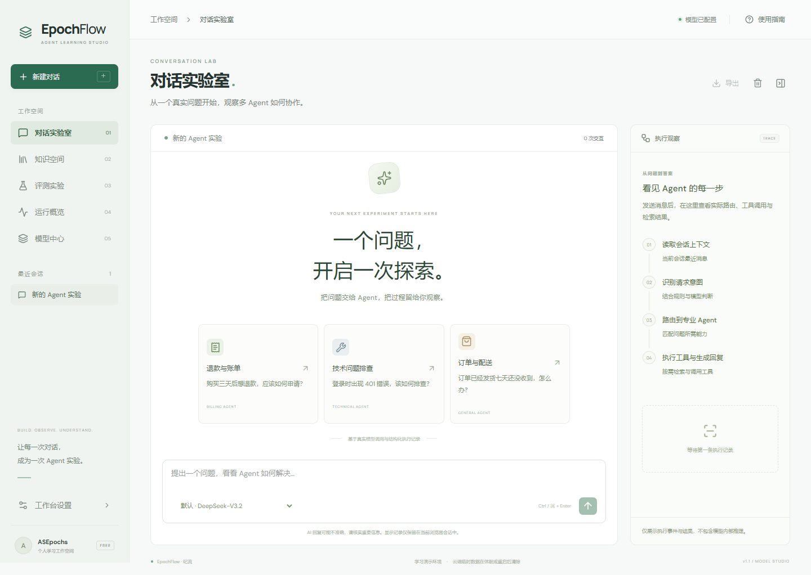
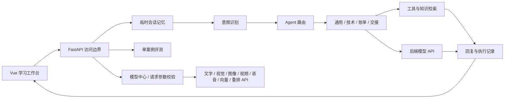
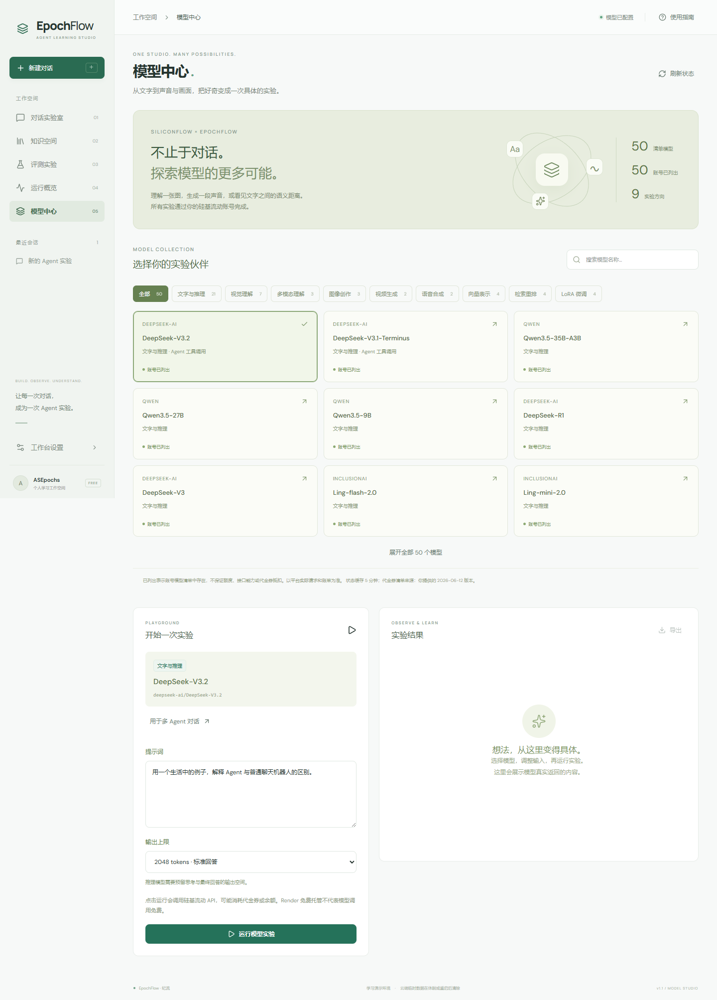

# EpochFlow · 纪流

**一个问题，开启一次 Agent 实验。**

[打开在线工作台](https://epochflow-web.onrender.com) · [后端健康状态](https://epochflow-api.onrender.com/health) · [GitHub 仓库](https://github.com/ASEpochs/epochflow)

线上工作台需要访问码，在“工作台设置”中填写。模型与 Render 密钥仅存在于本地忽略配置和 Render 后端环境变量中。

EpochFlow 是一个中文 Agent 学习工作台：把真实对话、意图识别、Agent 路由、知识检索、工具调用与评测放在同一个界面中，帮助你观察并理解一次请求的执行过程。



基于现有 EchoMind 项目独立改造，保留原始项目不变。当前用客服场景作为教学载体，业务工具中的订单与退款数据是教学示例，不连接真实商家系统。模型回答和执行记录来自实际运行。

## 工作空间

| 页面 | 可以做什么 |
| --- | --- |
| 对话实验室 | 新建与切换会话、Markdown 回复、代码块、复制、失败重试、导出记录 |
| 模型中心 | 50 个硅基流动模型、9 类实验、账号状态核验、媒体预览、向量相似度和检索重排 |
| 执行观察 | 意图与置信度、Agent 路由、工具输入输出、耗时和 request_id |
| 知识空间 | 查看资料、上传 TXT/MD/JSON、添加与移除文档、匹配检索、导出资料 |
| 评测实验 | 自定义单个意图案例或回复质量案例，查看真实评分并导出报告 |
| 运行概览 | 当前 Agent 调用统计、已加载 Skills 和请求流程 |
| 工作台设置 | 访问码、模型配置摘要、后端状态与数据限制 |

## 架构



前端按页面和组件拆分，API 客户端集中处理访问码、错误与超时。后端使用独立请求模型、访问边界和知识管理路由，保留原有编排与评测逻辑。

```text
frontend/src/
  components/      Markdown 回复与执行详情
  composables/     会话状态与运行状态
  views/           对话、模型中心、知识、评测、概览、设置
  lib/api.js       统一请求和导出
backend/
  api/             HTTP 入口、请求模型、访问边界、工作台接口
  agents/          Agent 编排与教学业务工具
  core/            意图识别、LLM 客户端、Skills 加载
  memory/          免费内存记忆与原完整存储实现
  mcp/             工具管理与知识检索
  evaluation/      意图和回复质量评测
  tests/           行为回归测试
```

## 本地运行

使用 Python 3.12 和 Node 22.16+。首次安装：

```powershell
cd backend
python -m venv .venv
.\.venv\Scripts\python.exe -m pip install -r requirements-free.txt
Copy-Item .env.example .env.local
cd ../frontend
npm ci
cd ..
```

在 backend/.env.local 配置供应商匹配的 ANTHROPIC_API_KEY、ANTHROPIC_BASE_URL 和 ANTHROPIC_MODEL，随后在项目根目录执行：

```powershell
python 启动开发.py
```

访问 http://127.0.0.1:5174 ，后端使用 8003。终端内 Ctrl+C 会停止本次启动的两个服务。脚本不操作其他项目或 Docker。若本机 Node PATH 指向旧版本，可设置 NODE_BINARY 为新版 node.exe 的完整路径。

默认 Agent 沿用 Anthropic Messages 兼容协议；切换 Agent 模型时，通过请求独立的 OpenAI 工具调用适配器执行。模型中心分别使用硅基流动的文字、多模态、生成和检索接口。模型密钥只由后端读取，不向浏览器发送。无密钥时仍可启动、检索和查看状态。

## 模型实验



50 个模型按 9 类组织：21 个文字与推理、7 个视觉理解、3 个多模态理解、3 个图像创作、2 个视频生成、2 个语音合成、4 个向量、4 个重排、4 个 LoRA 系列入口。完整 ID 见 `backend/core/model_catalog.py`。

- **选择与核验**：搜索或按能力筛选。通过账号 `/v1/models` 检查模型是否列出，缓存 5 分钟；不自动发起付费生成。列出状态不代表已验证所有调用权限或代金券抵扣。
- **Agent 对话**：DeepSeek-V3.2、V3.1-Terminus、Qwen3-Coder-30B-A3B-Instruct、Qwen3-30B-A3B-Instruct-2507 可选；每次请求独立选择并返回模型 ID。其他文字模型可在模型中心做单次实验。
- **多模态与创作**：支持 HTTPS 素材或 ≤700KB 文件、看图/音频/视频理解、文生图、图片编辑、语音合成；预览和保存结果。较大的素材使用平台可访问的公开链接。
- **视频任务**：生成与状态查询分离，任务编号保存在当前浏览器会话中；刷新后可以恢复查询，避免重复生成。云端结果链接会过期，请及时保存。
- **知识实验**：观察真实 embedding 向量及余弦相似度，比较 reranker 排序。不会替换知识空间的免费字符匹配方式。
- **LoRA**：这四项是微调系列入口，推理需要硅基流动训练完成后提供的实际模型 ID；本项目不自动创建训练任务。

详见 [模型接入说明与官方接口依据](docs/model-studio.md)。Render 仍为免费部署、不使用持久磁盘；模型 API 可能消耗代金券或账户余额。

## 免费部署

[Render 配置说明](docs/render-free.md) · [架构与运行限制](docs/architecture.md)

Render 配置只有一个 Free Python 后端和免费 Static Site，没有磁盘和数据库。免费模式不安装 Redis、Chroma 或本地向量模型。

- 云端会话、上传知识、评测历史及运行统计在休眠、重启或重新部署后清除。
- 浏览器会话记录保存在 sessionStorage，可手动导出；界面显示的历史不代表云端仍保留同样的上下文。
- 记忆最多 100 个会话，每会话 20 条消息，闲置一小时过期。
- 知识检索使用字符 n-gram 匹配，不是向量语义检索；预置文档重启时恢复。
- 上传限 1MB，知识库限 1000 个片段；评测限 5 案例/次，界面默认单案例。
- 生产请求需要访问码，模型接口最多并行 2 项、每分钟 12 项。工作台面向个人学习，不提供多租户账户隔离。
- Free 是 Render 实例计划，模型 API 由供应商另行计费。同一 Render workspace 的免费后端共享每月额度。

## 验证

```powershell
cd backend
.\.venv\Scripts\python.exe -m pip install pytest==8.3.4
.\.venv\Scripts\python.exe -m pytest -q tests/test_free_profile.py tests/test_agent_orchestrator.py tests/test_llm_utils.py tests/test_model_studio.py
cd ../frontend
npm run build
npm run test:e2e
```

端到端检查需要启动 5174 / 8003 预览以及可用 Chromium。CI 验证 Python 3.12 后端和前端生产构建。原数据库实现的测试需要完整依赖；历史运维文件收在 docs/legacy 中，仅供参考。

本项目根据既有 EchoMind 代码与学习资料改造，不将原有实现宣称为从零原创。原学习说明保留在 backend/wiki。
