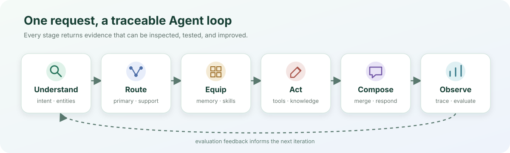
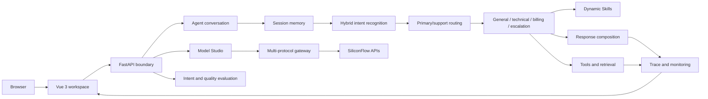

<div align="center">

# EpochFlow

### An observable, evaluable, and deployable multi-agent platform

**Understand requests · Orchestrate capabilities · Execute tools · Observe traces · Evaluate outcomes**

<p>
  <a href="https://epochflow-web.onrender.com/"><strong>🚀 Open the live system →</strong></a>
</p>

<p>No sign-up · No access code · Runs directly in the browser</p>

[](https://epochflow-web.onrender.com/)
[](https://github.com/ASEpochs/epochflow/actions/workflows/check.yml)
[](https://www.python.org/)
[](https://vuejs.org/)
[](https://render.com/)

<p>
  <a href="README.md">中文说明</a>
  ·
  <a href="docs/README.md">Documentation</a>
  ·
  <a href="docs/architecture.md">Agent Architecture</a>
  ·
  <a href="docs/project-guide.md">Project Guide</a>
</p>

</div>

> **Quick start:** Open the [live workspace](https://epochflow-web.onrender.com/) and enter “I cannot log in, and I also need a refund.” Inspect intent detection, primary/support Agent routing, and tool execution. Then explore Model Studio or Knowledge Space. A sleeping Render free instance may take about one minute to wake up.

## Why EpochFlow

EpochFlow is an Agent engineering platform for customer support and knowledge-service scenarios. It turns a model request into an inspectable workflow: **intent recognition → Agent routing → Skill injection → tool execution → knowledge retrieval → response composition → evaluation**.

The goal is to make an Agent system explainable as software: roles have explicit boundaries, execution can be traced, model providers can be switched, and quality can be checked repeatedly. The repository includes a Vue workspace, FastAPI service, multi-agent orchestrator, lightweight knowledge layer, model gateway, evaluation suite, automated tests, and cloud deployment.


## Capability map

| | Capability | What it solves |
| --- | --- | --- |
| 🧭 | **Intent & Routing** | Extracts intents and entities from mixed requests, then selects primary and supporting Agents |
| 🤖 | **Multi-Agent** | Isolates role prompts, output contracts, model settings, and tool permissions |
| 🧩 | **Skills & Tools** | Injects contextual rules and executes only tools allowed for the selected role |
| 📚 | **Knowledge** | Imports, chunks, retrieves, and feeds relevant context back into a conversation |
| 🔬 | **Model Studio** | Experiments with text, vision, generation, embedding, and reranking models in one UI |
| 📈 | **Observe & Evaluate** | Records routing and tool evidence, then checks quality with cases and LLM-as-Judge |

## At a glance

| Area | Current implementation |
| --- | --- |
| Agents | General, technical, billing, and escalation roles with primary/support collaboration |
| Models | 50 SiliconFlow model identifiers across 9 task categories |
| Tools | Per-Agent allowlists, argument validation, execution logs, caching, and fallbacks |
| Knowledge | Document import, chunking, retrieval, context injection, and browser export |
| Skills | 3 hot-reloadable business Skills selected by role and keywords |
| Observability | Request ID, intent confidence, routing rationale, tool I/O, and latency |
| Evaluation | Intent cases, conversation quality, LLM-as-Judge, and report export |
| Verification | 38 backend tests, 6 browser end-to-end tests, and GitHub Actions |
| Deployment | Vue static site plus a Python free web service, with no persistent disk |

## Agent loop



| Stage | Current implementation |
| --- | --- |
| Understand | Combines rules, templates, and model signals to return intent, entities, and confidence |
| Route | Selects a primary Agent and assigns supporting Agents for compound requests |
| Equip | Loads temporary memory and injects matching Skills, knowledge snippets, and tool definitions |
| Act | Validates arguments, calls allowlisted tools, and returns results to the model loop |
| Compose | Merges Agent and tool outputs into one consistent response |
| Observe | Returns request ID, routing rationale, tool logs, and latency; supports automated evaluation |

This loop shifts the engineering focus from only *what the model said* to *why the system routed that way, what it executed, and how the result is verified*.

## Core capabilities

### Routing-driven multi-agent collaboration

- Recognizes fine-grained intents and structured entities before selecting an Agent.
- Assigns one primary Agent and optional supporting Agents for compound requests.
- Gives each role its own system prompt, output contract, model settings, and tool allowlist.
- Returns routing rationale, confidence, participating roles, and tool execution details.

### Multi-protocol model gateway and Model Studio

- Adapts both Anthropic Messages and OpenAI Chat Completions style protocols.
- Isolates model selection per request so concurrent sessions cannot overwrite one another.
- Routes text, vision, image, video, speech, embedding, and reranking tasks to their corresponding APIs.
- Exposes 50 models in 9 task categories and checks their current account availability.
- Persists submitted video task identifiers in the browser so polling can resume after refresh.


### Knowledge, dynamic Skills, and evaluation

- Imports TXT, Markdown, and JSON documents and splits them into searchable chunks.
- Uses in-process character n-gram retrieval in the free deployment profile.
- Invalidates retrieval caches when knowledge changes.
- Reloads file-based business Skills at runtime and injects only matching rules.
- Runs intent and multi-turn conversation cases, with optional structured LLM-as-Judge scoring.

### Reliability and security boundaries

- Returns explicit errors for provider failures, timeouts, and invalid responses.
- Limits request/response size, request rate, and model concurrency at the backend boundary.
- Sanitizes rendered Markdown with DOMPurify.
- Keeps provider credentials on the server and never sends them to the browser.

## Architecture



The static Vue frontend and FastAPI backend run as separate Render services. Provider credentials remain on the backend. See [Architecture and runtime conventions](docs/architecture.md) for implementation boundaries.

## Design and implementation scope

EpochFlow covers the following end-to-end engineering areas:

- **Product:** project positioning, information architecture, demo routes, and public-use boundaries;
- **Agent architecture:** intent recognition, primary/support routing, role contracts, Skills, and tool loop;
- **Model engineering:** protocol adaptation, per-request model isolation, and nine model task APIs;
- **Knowledge and evaluation:** document lifecycle, lightweight retrieval, embedding/reranking experiments, and LLM-as-Judge;
- **Frontend:** conversation workspace, execution inspector, Model Studio, Knowledge Space, evaluation, and overview;
- **Delivery:** request protection, error handling, automated testing, CI, secret isolation, and Render deployment.

## Tech stack

| Layer | Technology |
| --- | --- |
| Frontend | Vue 3, Vite, Lucide Icons, Marked, DOMPurify |
| Backend | Python 3.12, FastAPI, Pydantic, HTTPX, Anthropic SDK |
| Agent | Intent recognition, structured routing, primary/support Agents, Skills, tool loop |
| AI | SiliconFlow, DeepSeek, Qwen, GLM, embedding, reranking, multimodal generation |
| Data | In-process session memory, character n-gram retrieval, sessionStorage |
| Test | Pytest, FastAPI TestClient, Playwright |
| Delivery | GitHub Actions, Render, environment variables, CORS, rate limits, health checks |

## Run locally

Requirements: Python 3.12 and Node.js 22.16+.

```powershell
git clone https://github.com/ASEpochs/epochflow.git
cd epochflow/backend
python -m venv .venv
.\.venv\Scripts\python.exe -m pip install -r requirements-free.txt
Copy-Item .env.example .env.local

cd ../frontend
npm ci
cd ..
python 启动开发.py
```

Set the model provider in `backend/.env.local`:

```dotenv
ANTHROPIC_API_KEY=your_api_key
ANTHROPIC_BASE_URL=https://api.siliconflow.cn
ANTHROPIC_MODEL=deepseek-ai/DeepSeek-V3.2
```

Open `http://127.0.0.1:5174`. The development API uses port `8003`; press `Ctrl+C` in the launcher terminal to stop both processes.

## Verification

```powershell
cd backend
.\.venv\Scripts\python.exe -m pytest -q `
  tests/test_free_profile.py `
  tests/test_agent_orchestrator.py `
  tests/test_llm_utils.py `
  tests/test_model_studio.py

cd ../frontend
npm run build
npm run test:e2e
```

The current checks cover model parameters, Agent tool execution, concurrent model isolation, request boundaries, knowledge lifecycle, embedding order, reranking output, XSS sanitization, responsive layouts, and video task recovery. See current status in [GitHub Actions](https://github.com/ASEpochs/epochflow/actions).

## Free deployment profile

- **Frontend:** Render Static Site;
- **Backend:** Render Free Python Web Service;
- **Models:** remote SiliconFlow APIs;
- **Storage:** temporary in-process memory, no persistent disk;
- **Release:** automatic builds from the GitHub `main` branch.

See [`render.yaml`](render.yaml) and the [free Render deployment guide](docs/render-free.md).

## Current boundaries

- A sleeping Render free instance may take about one minute to wake up.
- Conversation memory, uploaded knowledge, and runtime statistics are cleared on restart or redeployment.
- Public visitors share one temporary knowledge space; do not upload private or sensitive material.
- Model calls are limited to 2 concurrent tasks and 12 tasks per minute to control public demo usage.
- Image and video results are temporarily hosted by the model provider and should be saved promptly if needed.
- Order and refund tools use sanitized demonstration data and do not connect to a real merchant system.

## Documentation

- [Documentation index](docs/README.md)
- [Architecture and runtime conventions](docs/architecture.md)
- [Project guide and design notes](docs/project-guide.md)
- [Model Studio](docs/model-studio.md)
- [Free Render deployment](docs/render-free.md)

---

**Author:** [ASEpochs](https://github.com/ASEpochs)

**Repository:** [github.com/ASEpochs/epochflow](https://github.com/ASEpochs/epochflow)

**Live demo:** [epochflow-web.onrender.com](https://epochflow-web.onrender.com/)
